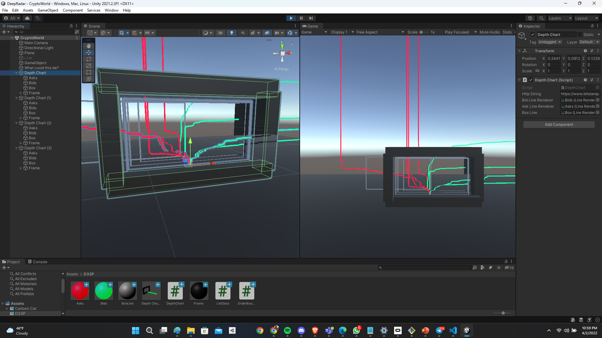

# D33P Radar
The purpose of this project is to build a reconfigurable depth chart that works in the Unity game engine, so that multiple depth charts can be viewed by layering them in front and back of eachother.

